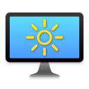
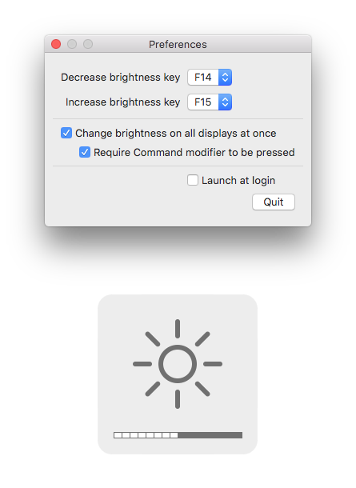

<h1 align="center">External&shy;Display&shy;Brightness</h1>
 

A Mac app to control the brightness of external displays using keyboard shortcuts.

About
-----
ExternalDisplayBrightness is a small utility which allows you to change the brightness of external displays connected to your Mac using keyboard shortcuts, just as you would change the brightness of the built-in display on a Macbook.

This is a small summer project which I did to get some practice with developing Mac apps. There are a bunch of similar projects available, but they feel hard to use and are cluttered with too many options. I wanted to make something simple which would Just Work™ and you could forget it's even there.

Installation
------------
ExternalDisplayBrightness supports macOS 10.13 High Sierra and higher.

To install, download the [latest DMG release](https://www.github.com/fnesveda/ExternalDisplayBrightness/releases/latest), open it and drag *ExternalDisplayBrightness.app* to your Applications folder.

Usage
-----
During the first launch, the app will request permission to use accessibility services on your Mac to listen for keyboard shortcuts. Grant the permission and relaunch the app for the change to take effect.

The app runs as a hidden agent app, silently listening for keyboard shortcuts. To access the preferences, simply launch the app again using Launchpad or any other method, and the preferences window will open. The app keeps listening for keyboard shortcuts when you close the preferences window. To completely quit the app, use the Quit button in the window.

You can customize the keyboard shortcuts for the brightness actions to any of the F1 - F20 keys or the brightness keys on the Magic Keyboard (listed as MK_BDN and MK_BUP in the preferences).
By default the application takes over the default brightness keys on a Mac keyboard, which are mapped to F14 and F15, respectively. When pressing the keyboard shortcut in combination with Option + Shift, the brightness changes in smaller increments, just like on a real Mac.

There is also an option to control the brightness of all connected displays simultaneously, by default triggered by using the keyboard shortcut in combination with the Command modifier. This behavior is also customizable in the app's preferences.

Compatibility
-------------
ExternalDisplayBrightness uses the [DDC/CI standard](https://en.wikipedia.org/wiki/Display_Data_Channel#DDC/CI) commands to control the brightness of external displays. For the app to work, your display needs to support the DDC/CI standard properly. Most displays do, but there are some issues with Samsung displays (and possibly others), which do not implement the standard correctly. Unfortunately, there is not much that can be done to remedy the situation.

There are some issues with certain Mac models which freeze when attempting to read the current brightness of the external display. Because of that, reading the initial brightness of the display is disabled by default, and when changing the brightness of a display for the first time, its initial brightness is set to 50%. You can enable reading the brightness from the display in the app's preferences, but do so at your own risk.

Additionally, it seems the HDMI port on the 2018 Mac Mini does not work with the DDC/CI interface. Using an USB-C to HDMI adapter should work fine, though.

Developing
----------
The utility is a standard Xcode & Swift project without any external dependencies. You can just download/clone the repository and open *src/ExternalDisplayBrightness.xcodeproj* to start making changes. 

The whole project is written in Swift 4.2, without using any Objective-C bridging headers.

### Quirks and perks

Due to the way the utility listens for global keyboard shortcuts (using CGEvents, to be able to consume them), it has to use Accessibility Services, and due to the way the app manages its login item (through [Launch Services](https://developer.apple.com/documentation/coreservices/launch_services)), App Sandbox can't be enabled. This means the app can't be released on the Mac App Store, at least for now.

There are several things you might find useful or interesting when poking through the code.
*DDC.swift* contains a simple Swift implementation of sending DDC/CI commands over I2C to a connected display. Feel free to use it in any of your projects, I hope it will be helpful to someone.

*LoginItemManager.swift* contains an implementation of a login item manager for the app.
There is a bunch of login item managers available already, I implemented it in a way that you can bind the property *isEnabled* of the manager to a checkbox in Interface Builder through the included value transformer *LoginItemCheckboxTransformer*. 
Unfortunately, Apple deprecated the APIs to access the login item list starting from Sierra, without offering any real alternative.
I hope these will keep working for at least a few more years, but eventually this will need to be rewritten to utilize the Service Management Framework, which will have the side effect of not showing the login item in System Preferences.

*BrightnessManager.swift* contains an implementation of a manager of the brightness of the connected displays.
The brightness of external displays is controlled through the aforementioned *DDC/CI* commands, the brightness of internal displays is controlled through some undocumented and private APIs in DisplayServices and CoreDisplay which might break at any time. Before Sierra, the internal display brightness could be changed through IOKit, but after the introduction of Night Shift in 10.12.4 something changed and the brightness changes don't stick anymore. This is one of the reasons the app works only on High Sierra and higher, because the new CoreDisplay APIs weren't around in 10.12.3 and lower, and I didn't want to complicate the brightness changing logic too much.
The native popup with the brightness bars is displayed through some more private undocumented APIs, this time of the OSD framework.
You might find the code to load these private frameworks through CFBundle and NSBundle useful, it took me a while to figure out how to get the function pointers relatively safely, so maybe this will help you get there faster.

Links
-----
- [Project homepage](https://www.nesveda.com/projects/ExternalDisplayBrightness/)
- [Project repository](https://www.github.com/fnesveda/ExternalDisplayBrightness/)
- related projects
    - [ddcctl by kfix](https://github.com/kfix/ddcctl/) - a command line tool to control external monitors

Licensing
---------
The code in this project is licensed under the MIT license.
Everybody is welcome to use, change and modify the project as they see fit.
